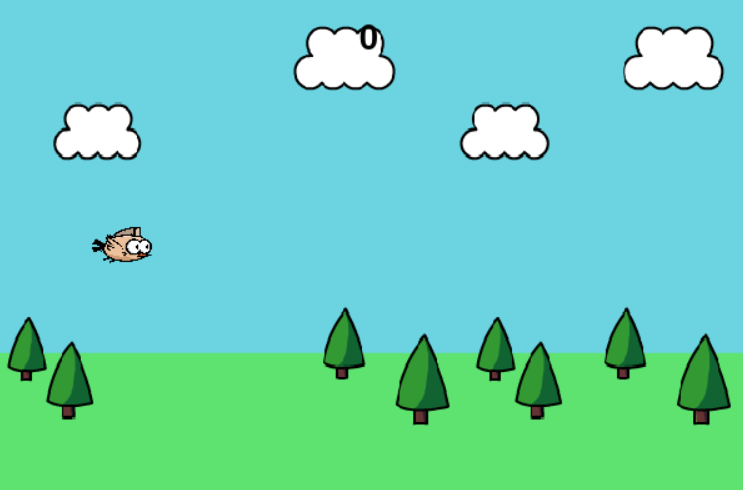
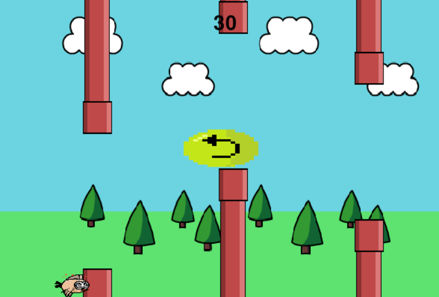
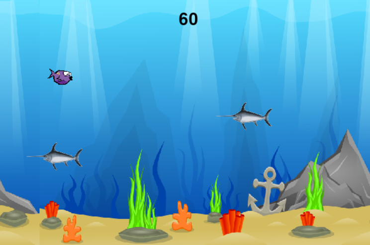

# 🐦🐠 Flappy Bird-Fish Adventure

Bu proje, klasik Flappy Bird oyunundan ilham alınarak **Python** ve **Pygame** kullanılarak geliştirilmiş eğlenceli bir 2D oyundur. Oyunun temel amacı, engellerden kaçarken mümkün olduğunca fazla puan toplamaktır. Ancak bu versiyonda işin içine sürprizler de giriyor:

🎯 **Her 50 puanda bir:**
- Arka plan değişir  
- Karakter dönüşüm geçirir (Kuş → Balık)  
- Yeni engeller ortaya çıkar (Borular yerine kılıç balıkları)

---

## 📸 Oyundan Görseller
  
  
  


---

## 🚀 Özellikler
- 🎮 Pygame tabanlı 2D oyun mekaniği  
- 🔁 Skor arttıkça *karakter ve tema değişimi*  
- 🐠 Balık modunda borular yerine *kılıç balıkları*  
- 🔊 Özel ses efektleri ve sprite animasyonları  
- 🎯 Kolay kontrol: sadece *boşluk* ya da *fare tıklaması*  
- 💀 Oyun sonu ekranı ve *restart* butonu  

---

## 🕹 Oynanış
- ⌨️ *Boşluk (Space)*: Zıplama  
- 🖱 *Sol tık (Mouse Click)*: Zıplama  

---

## 📁 Notlar
- `assets/` klasörü tüm resim, ses ve animasyon dosyalarını içerir.  
- `main.py` oyun döngüsünü başlatır.

---

## ⚙ Kurulum ve Çalıştırma

### Gereksinimler
- Python 3.x  
- Pygame kütüphanesi

### Kurulum
```bash
git clone https://github.com/EceeBasaran/flappy-bird-fish-game
cd flappy-bird-fish-game
pip install pygame
python main.py

---

## 👥 Geliştiriciler

Bu proje aşağıdaki ekip tarafından geliştirilmiştir:

- 🧠 **Ece Başaran** – [@EceeBasaran]  
- 🎨 **Şevval Sönmez** – [@sevvalsonmezz]  
- 🎵 **Ceyda Avcı** – [@cydavc]

